# SiteForecaster

> **Naming note:** This project originally started under the name **GroundSignal**. I made the slightly painful but useful mistake of choosing the project name before checking whether the matching domain was available.
>
> The public facing product was later renamed **SiteForecaster**, which is the name used on the live site. I have kept the GitHub repository name as `groundsignal` for now because recently sent CV's already link directly to this repository.
>
> Lesson learned: check domain availability before getting attached to a name. 🙂

Planning intelligence platform for discovering local construction opportunities from Irish planning data.

**Live site:** [https://siteforecaster.com](https://siteforecaster.com)

## Table of Contents

1. [Project Overview](#1-project-overview)
2. [Project Aims](#2-project-aims)
3. [Problem Statement](#3-problem-statement)
4. [Target Audience](#4-target-audience)
5. [User Goals](#5-user-goals)
6. [Product Value](#6-product-value)
7. [User Experience](#7-user-experience)
8. [User Stories & Agile Development](#8-user-stories--agile-development)
9. [Design](#9-design)
    - [Visual Design](#91-visual-design)
    - [Wireframes & Layout Planning](#92-wireframes--layout-planning)
    - [Responsive Design](#93-responsive-design)
    - [Accessibility](#94-accessibility)
10. [Features](#10-features)
    - [Location Search](#101-location-search)
    - [Planning Opportunity Discovery](#102-planning-opportunity-discovery)
    - [Opportunity Scoring](#103-opportunity-scoring)
    - [Electrical Work Signals](#104-electrical-work-signals)
    - [Sorting & Pagination](#105-sorting--pagination)
    - [Application States & Error Handling](#106-application-states--error-handling)
11. [Opportunity Scoring Logic](#11-opportunity-scoring-logic)
12. [Application Architecture](#12-application-architecture)
    - [Frontend](#121-frontend)
    - [Backend](#122-backend)
    - [API Layer](#123-api-layer)
    - [Database](#124-database)
13. [Data Flow](#13-data-flow)
    - [User search flow](#user-search-flow)
    - [Location lookup flow](#location-lookup-flow)
    - [Planning data sync flow](#planning-data-sync-flow)
14. [API Endpoints](#14-api-endpoints)
15. [Database & Data Models](#15-database--data-models)
16. [Geocoding & Location Handling](#16-geocoding--location-handling)
17. [Security & Privacy](#17-security--privacy)
    - [API & Secret Management](#171-api--secret-management)
    - [Rate Limiting](#172-rate-limiting)
    - [Privacy-Safe Logging](#173-privacy-safe-logging)
    - [Security Headers](#174-security-headers)
18. [Data Licensing & Legal Considerations](#18-data-licensing--legal-considerations)
19. [Technologies Used](#19-technologies-used)
20. [Testing & Quality Assurance](#20-testing--quality-assurance)
    - [Backend Testing](#201-backend-testing)
    - [Frontend Testing](#202-frontend-testing)
    - [Linting & Build Validation](#203-linting--build-validation)
    - [Accessibility Testing](#204-accessibility-testing)
    - [Manual & Production Testing](#205-manual--production-testing)
21. [Continuous Integration](#21-continuous-integration)
22. [Docker & Local Development](#22-docker--local-development)
23. [Deployment](#23-deployment)
    - [AWS EC2](#231-aws-ec2)
    - [Docker Compose](#232-docker-compose)
    - [Nginx](#233-nginx)
    - [Frontend Deployment](#234-frontend-deployment)
    - [Automated Planning Sync](#235-automated-planning-sync)
24. [Environment Variables](#24-environment-variables)
25. [Local Installation & Setup](#25-local-installation--setup)
26. [Monitoring & Production Operations](#26-monitoring--production-operations)
27. [Bugs & Fixes](#27-bugs--fixes)
28. [Known Limitations](#28-known-limitations)
29. [Future Development](#29-future-development)
30. [Credits & Data Sources](#30-credits--data-sources)
31. [Acknowledgements](#31-acknowledgements)

## 2. Project Aims

The main aim of SiteForecaster is to help electrical contractors find relevant local construction opportunities without having to manually search through large volumes of planning application data.

Planning data is publicly available, but it can be difficult and time-consuming to work through. SiteForecaster takes this information and presents it in a more useful way by allowing users to search by location, review nearby planning applications, and quickly identify projects that may involve electrical work.

The project aims to:

- make Irish planning data easier to search and understand.
- help electrical contractors find potential work opportunities in their area.
- rank opportunities using a clear and consistent scoring system.
- highlight planning applications where electrical work is confirmed, likely, possible, or not specifically identified.
- provide enough information for users to decide which opportunities are worth investigating further.
- keep planning data reasonably up to date through automated background syncing.
- provide a responsive and accessible interface that works across desktop, tablet, and mobile devices.

From a development point of view, the project was also built to demonstrate how a modern full-stack application can be designed, tested, deployed, and maintained in a production environment.

## 3. Problem Statement

Irish planning application data contains useful information about upcoming construction and development projects. For tradespeople such as electricians, this can provide an early indication of where future work may become available.

The problem is that the raw planning data is not designed specifically for contractors looking for work. A large number of applications may need to be reviewed before finding one that is relevant, and important details can be spread across descriptions, development types, locations, and other fields.

For a small electrical contractor, manually searching this information regularly would take time and still make it easy to miss useful opportunities.

SiteForecaster addresses this by processing planning applications and presenting them through a contractor-focused interface. Applications can be searched by location and are given an opportunity score based on factors such as project scope, scale, timing, category, and signs of electrical work.

The aim is not to guarantee that a planning application will become a paid job. Instead, SiteForecaster helps reduce the amount of planning data a contractor needs to review and gives them a more focused starting point for finding potential opportunities.

## 4. Target Audience

The current version of SiteForecaster is aimed primarily at electrical contractors and electricians working in Ireland.

This includes:

- self-employed electricians looking for new local work.
- small electrical contracting businesses that want to identify upcoming projects.
- contractors who want to spend less time manually searching planning records.
- businesses interested in finding residential, commercial, industrial, public, or mixed-use developments that may require electrical work.

The platform is particularly useful for smaller contractors who may not have dedicated sales or business-development staff but still want an organised way to identify potential work in their area.

SiteForecaster is currently focused on electricians, but the underlying planning-data and opportunity-scoring approach could later be adapted for other construction trades if there is a clear business case.

## 5. User Goals

SiteForecaster is designed to help users find relevant planning opportunities quickly and with less manual searching.

The main user goals are to:

- search for planning opportunities near a chosen location.
- quickly understand which applications are most relevant.
- identify projects that may involve electrical work.
- compare opportunities using a clear scoring system.
- review useful project details without opening every planning record individually.
- sort and filter results so the strongest opportunities can be reviewed first.
- open the original planning application when more detail is needed.
- use the platform easily across desktop, tablet, and mobile devices.

The overall goal is to reduce the time spent searching through planning data and help users focus their attention on the applications most likely to be worth investigating.

## 6. Product Value

The value of SiteForecaster is not that it creates new planning data. The value comes from making existing public planning information easier to use for a specific type of contractor.

Instead of treating every planning application equally, SiteForecaster adds an extra layer of analysis. Applications are scored and ranked based on factors such as project scale, timing, category, scope, and signs of electrical work.

This helps users:

- spend less time reviewing low-value or irrelevant applications.
- spot stronger opportunities earlier.
- understand why one project may be more relevant than another.
- work from a more focused list of potential leads.
- use public planning information in a way that is more practical for business development.

SiteForecaster is intended to support decision-making rather than replace it. A high-scoring opportunity is not a guaranteed job, and users are still expected to review the original planning application before taking any further action.

## 7. User Experience

The user experience was designed around one main idea: finding useful planning opportunities should be quick and easy to understand.

A user can enter a location, choose a search radius, and view nearby planning applications without needing to understand the structure of the underlying planning dataset. Results are presented as opportunity cards with the most useful information shown first.

The interface gives particular attention to:

- clear opportunity scores and labels.
- simple electrical-work indicators.
- readable project descriptions and addresses.
- sorting options that help users prioritise stronger opportunities.
- clear loading, empty, error, and retry states.
- responsive layouts across desktop, tablet, and mobile devices.
- accessible headings, labels, focus states, and interactive controls.

The opportunity detail view provides more information when needed without overloading the main results page. Users can also follow the official planning application link if they want to verify the source information or investigate the project further.

The design avoids unnecessary complexity. The aim is to help a contractor understand the value of a planning application quickly, rather than forcing them to interpret technical planning data themselves.

## 8. User Stories & Agile Development

SiteForecaster was planned and tracked using a GitHub Agile board. The work was grouped into epics and user stories, which helped track progress from early development through to the current MVP stage.

### Agile Board Progression

GitHub Projects was used throughout development to track epics, user stories and their current status. The board used the workflow **Todo → In Progress → Testing / In Review → Done**, which made it easy to see what had been planned, what was actively being developed and what had been completed.

| Board Stage | Summary |
| --- | --- |
| During development | Board shows active work across Epics, Todo, In Progress and Done, reflecting the build-out of the MVP. |
| Current state | Board is now mostly complete, with the remaining open items focused on the README/documentation and future features such as authentication and shortlist saving. |

The earlier board below shows SiteForecaster during active MVP development. At this point, all seven main epics were still visible, several Must-have stories were waiting to be started, and core work such as planning classification, database migrations and automated testing was still in progress.

#### Agile Board During Development

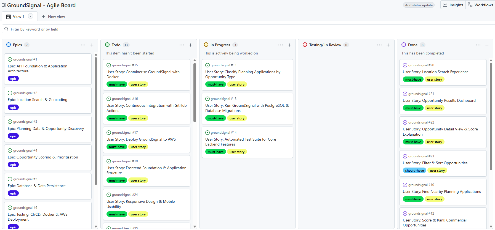

As development progressed, completed stories and epics were moved into **Done**. Work was prioritised around the Must-have functionality needed for the MVP before moving on to lower-priority improvements.

The current board shows the result of that process. The main MVP engineering work is complete, with 28 items in **Done**. The remaining open stories are the README/documentation work currently being completed and two future features: user authentication and saved opportunity shortlists.

#### Current Agile Board

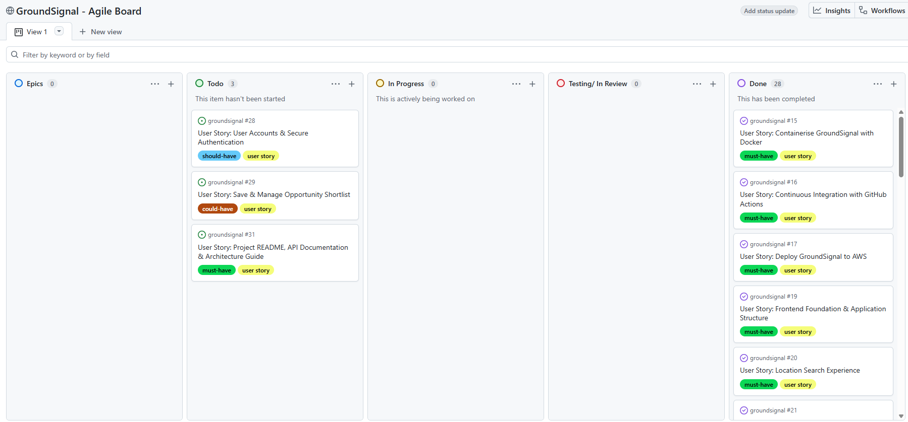

This progression provides a clear record of the project moving from planned epics and active development to a completed working MVP, while keeping future development separate from the functionality required for the initial release.

#### Agile Workflow and Prioritisation

The board used a simple workflow: Todo, In Progress, Testing / In Review and Done. Work was prioritised so the core user value was delivered first. Must-have stories were completed before lower-priority future features, which kept the MVP focused and realistic.

### Epic Summary

The work was grouped into epics to keep development organised and make the main areas of the MVP clear.

| Epic | Purpose | Status |
| --- | --- | --- |
| API Foundation & Application Architecture | Built the FastAPI backend structure and core application setup. | Complete |
| Location Search & Geocoding | Added location search, geocoding and current-location support. | Complete |
| Planning Data & Opportunity Discovery | Connected planning data and enabled discovery of nearby applications. | Complete |
| Opportunity Scoring & Prioritisation | Added opportunity scoring and ranking. | Complete |
| Database & Data Persistence | Added PostgreSQL/PostGIS persistence and database migrations. | Complete |
| Testing, CI/CD, Docker & AWS Deployment | Added containerisation, testing, CI and the deployment workflow. | Complete |
| User Experience & Tradesperson Dashboard | Delivered the dashboard, responsive UI, accessibility and production polish. | Complete |

### User Story Progress

User stories were prioritised using **Must-have**, **Should-have** and **Could-have** labels. Core MVP functionality was completed first, while lower-priority features were left for future development.

#### Must-have User Stories

All Must-have stories listed below have been completed.

| Must-have User Story | Outcome |
| --- | --- |
| Search & Geocode a Location | Users can search for an Irish location and receive usable coordinates. |
| Store & Query Planning Applications | Planning application data is stored and available through the API. |
| Find Nearby Planning Applications | Users can find planning applications near a selected location. |
| Classify Planning Applications by Opportunity Type | Applications are grouped by opportunity type to make results easier to review. |
| Score & Rank Commercial Opportunities | Opportunities are scored and ranked to help users focus on stronger leads. |
| Run GroundSignal with PostgreSQL & Database Migrations | The application uses PostgreSQL/PostGIS with managed schema migrations. |
| Automated Test Suite for Core Backend Features | Core backend behaviour is covered by automated tests. |
| Containerise GroundSignal with Docker | The backend and database can run in Docker containers. |
| Continuous Integration with GitHub Actions | Automated backend and frontend checks run through GitHub Actions. |
| Deploy GroundSignal to AWS | The application is deployed to AWS EC2. |
| Frontend Foundation & Application Structure | The React application has a structured component, routing and API setup. |
| Location Search Experience | Users can search by location or use their current location. |
| Opportunity Results Dashboard | Users can view ranked nearby opportunities in a clear results layout. |
| Opportunity Detail View & Score Explanation | Users can review project details and understand the opportunity score. |
| Responsive Design & Mobile Usability | The interface works across desktop, tablet and mobile devices. |
| Automated Planning Data Ingestion & Refresh | Planning data is imported and refreshed automatically. |
| Production Security & Configuration Hardening | Production configuration, dependency checks and privacy controls were reviewed and hardened. |

#### Should-have User Stories

The following Should-have stories were also completed as part of the MVP.

| Should-have User Story | Outcome |
| --- | --- |
| Filter & Sort Opportunities | Users can sort and filter results to focus on relevant opportunities. |
| UI Design System, Accessibility & User Feedback | The interface includes consistent styling, accessible controls and clear application states. |
| Frontend Testing & Core User Journey Validation | Important frontend journeys are covered by automated tests. |
| Production Health Monitoring & Operational Error Handling | A dedicated health check and production-safe operational monitoring approach were added. |

#### Remaining / Future User Stories

| User Story | Priority | Status | Reason |
| --- | --- | --- | --- |
| Project README, API Documentation & Architecture Guide | Must-have | In progress | Final project documentation is currently being completed. |
| User Accounts & Secure Authentication | Should-have | Future development | Authentication is useful but not required for the initial MVP. |
| Save & Manage Opportunity Shortlist | Could-have | Future development | Saving opportunities depends on user accounts and is outside the current MVP scope. |

### Development Outcome

The board shows clear progress from planning to delivery. The MVP is now largely complete, with documentation and future enhancements left open.

## 9. Design

The design of SiteForecaster was kept simple and practical. The main aim was to make planning information easy to scan while keeping the interface suitable for contractors using the application on desktop, tablet or mobile devices.

### 9.1 Visual Design

#### Colour Scheme

SiteForecaster uses a small colour palette built around dark navy, light neutral backgrounds and an orange accent.

The main colours are:

- `#F6F7F8` — main page background.
- `#FFFFFF` — cards, panels and form controls.
- `#172A3A` — primary dark colour used for headings, navigation and important text.
- `#D9DEE5` — borders, dividers and subtle interface structure.
- `#F59E0B` — primary accent colour used for buttons, highlights and opportunity indicators.

The dark navy and orange provide clear contrast for important actions, while the light background and white surfaces keep the results area easy to scan.

The colour palette was reviewed using Coolors to provide a simple visual reference.


#### Typography

SiteForecaster uses `Inter` as the preferred typeface, followed by a system UI font stack:

`Inter, ui-sans-serif, system-ui, -apple-system, BlinkMacSystemFont, "Segoe UI", sans-serif`

Inter was chosen because it was designed for screen-based interfaces and provides good readability at smaller sizes. Its tall x-height helps lowercase text remain clear, which is useful for an application containing planning descriptions, addresses, labels and numerical information.

The interface uses heavier font weights for headings, scores and important labels, while standard and muted text styles are used for supporting information. This creates a clear hierarchy without introducing multiple typefaces.

Inter is the preferred font but is not bundled or loaded externally by the project. Where it is not installed, the browser uses the system UI fallback fonts. Google Maps attribution uses Roboto separately where required by its attribution styling; it is not a main SiteForecaster interface font.

### 9.2 Wireframes & Layout Planning

Wireframes were created for mobile and tablet layouts before finalising the responsive interface.

The smaller-screen layouts were the main focus because they required the most thought around stacking form controls, keeping search actions usable and presenting opportunity cards without overcrowding the screen.

#### Mobile Wireframe

The mobile wireframe was used to explore a narrow single-column layout where the search controls and opportunity results stack vertically. The main aim was to keep the interface easy to use on smaller screens without overcrowding the page.

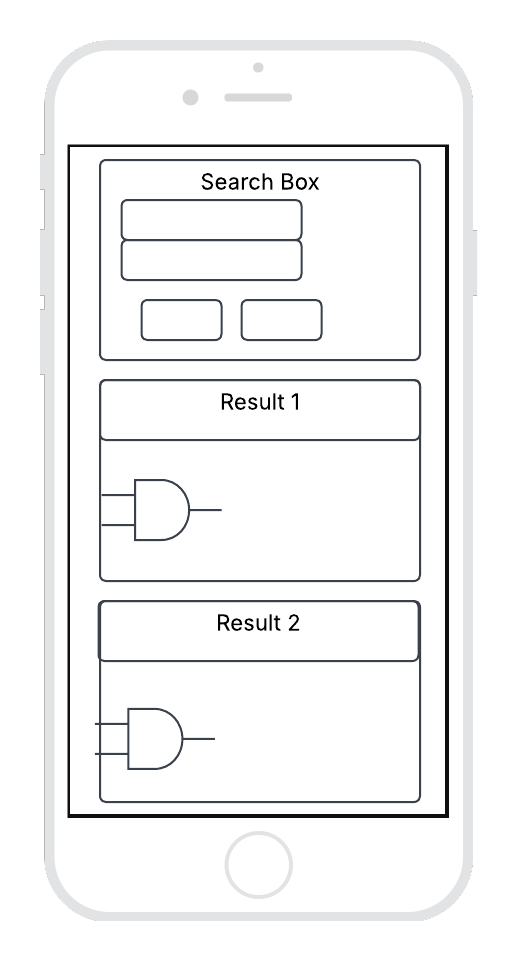

#### Tablet Wireframe

The tablet wireframe was used to explore how the additional horizontal space could be used while keeping controls large enough for touch input and keeping opportunity results easy to scan.

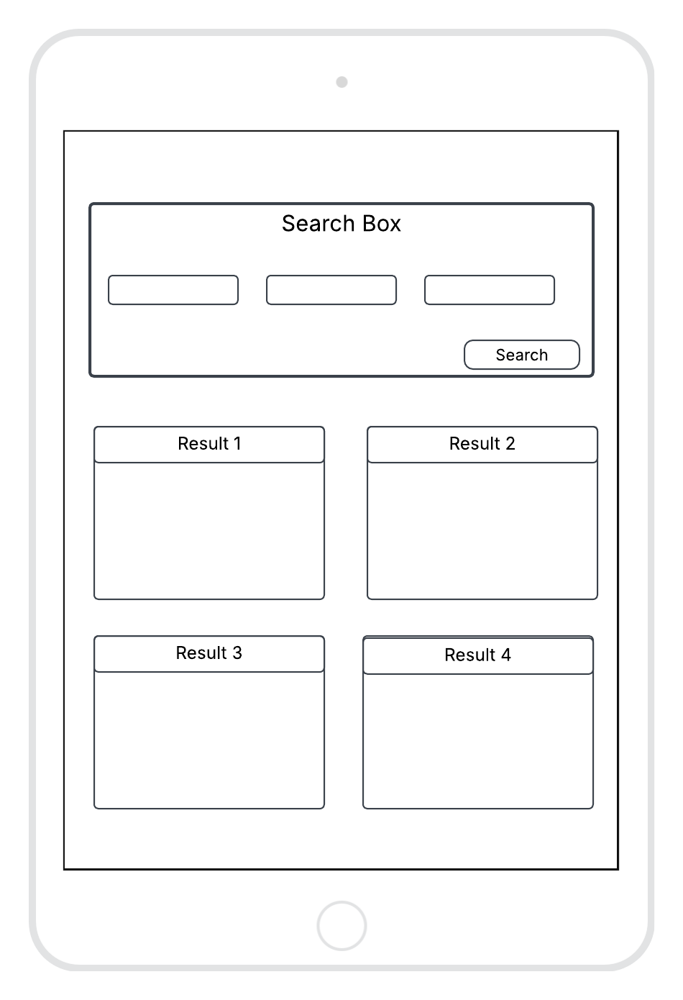

The mobile and tablet wireframes helped guide the larger-screen layout, where the additional width allowed search controls and results to use wider grid-based layouts.

### 9.3 Responsive Design

Responsive behaviour was refined throughout development so that the interface remained usable across mobile, tablet and desktop screen sizes. Smaller screens required the most layout adjustment, particularly around search controls, opportunity cards and spacing.

The interface adapts across screen sizes by:

- stacking search controls vertically on narrow screens.
- allowing controls to use more horizontal space on tablets and desktops.
- changing opportunity layouts to use available width without horizontal scrolling.
- maintaining readable spacing and text sizes.
- keeping buttons and interactive controls suitable for touch input.
- allowing result cards and detail content to reflow rather than relying on fixed widths.

Responsive behaviour was tested across mobile, tablet and desktop viewport sizes during development.

#### Mobile Implementation

The screenshots below show the completed SiteForecaster interface running on a real mobile browser, demonstrating how the search, results and opportunity detail layouts adapt to a narrow screen.

**Mobile Homepage**

| Mobile search | Mobile results |
| --- | --- |
| 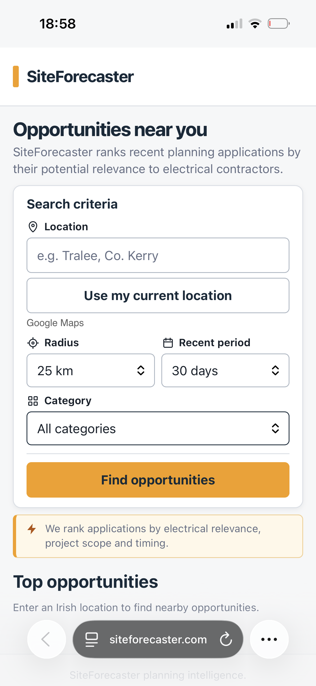 | 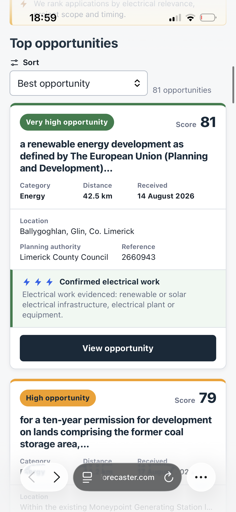 |
| SiteForecaster header, search criteria form and primary search action. | Ranked opportunity results and responsive opportunity cards. |

**Mobile Opportunity Detail**

| Opportunity overview | Opportunity breakdown |
| --- | --- |
| 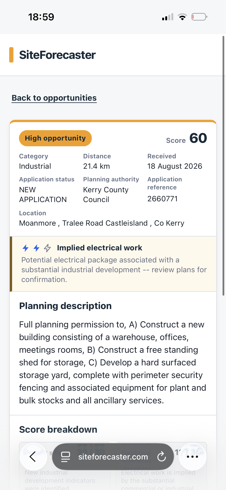 | 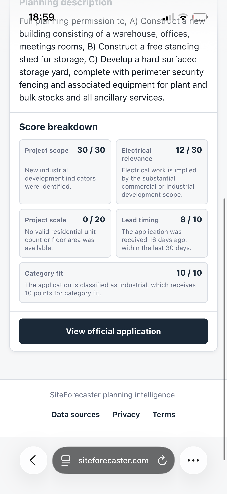 |
| Opportunity score, project information and electrical-work signal. | Score breakdown, official application action and responsive footer. |

### 9.4 Accessibility

Accessibility was considered throughout the interface, particularly around navigation, forms and the presentation of planning results.

The implemented accessibility work includes:

- semantic page structure and logical heading levels.
- clear labels for form controls and search inputs.
- visible keyboard focus states for links, buttons and interactive controls.
- keyboard-accessible navigation and actions.
- colour choices designed to maintain readable contrast between text, backgrounds and controls.
- clear loading, empty, success and error states rather than relying on colour alone.
- touch-friendly controls and responsive layouts for smaller screens.
- reduced-motion support for the loading spinner.
- descriptive text and labels so important actions do not rely only on icons.

Accessibility was also reviewed during frontend testing. More detailed validation and test results are documented in the [Accessibility Testing](#204-accessibility-testing) section.

## 10. Features

### 10.1 Location Search

SiteForecaster gives users two ways to choose where they want to search. They can enter an Irish location manually, which is resolved through geocoding when the search runs, or they can use the browser's current-location option to search around their device location.

Once a location has been selected, the search can be refined using the radius, recent-period and category controls. Selecting **Find opportunities** sends the chosen criteria to the backend and returns nearby planning applications that match the search.

The screenshots below show the main stages of this flow: entering a location manually, using the current-location option, viewing the default search state, and running a completed search that returns ranked opportunities.

<table>
  <tr>
    <th width="50%" align="center">Location entered</th>
    <th width="50%" align="center">Current location</th>
  </tr>
  <tr>
    <td width="50%" align="center" valign="top">
      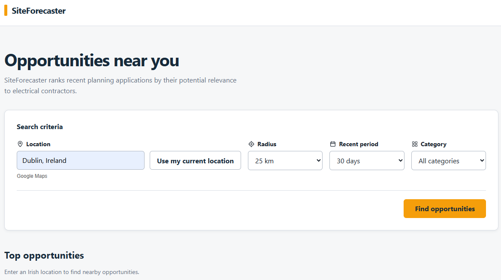
    </td>
    <td width="50%" align="center" valign="top">
      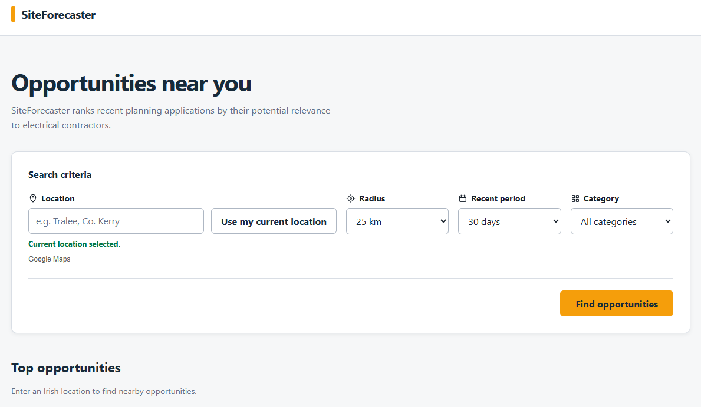
    </td>
  </tr>
  <tr>
    <td width="50%" align="center">A manually entered Irish location ready to be used for the search.</td>
    <td width="50%" align="center">The browser current-location option selected, allowing SiteForecaster to search around the user's device location.</td>
  </tr>
</table>

<table>
  <tr>
    <th width="50%" align="center">Initial search</th>
    <th width="50%" align="center">Search results</th>
  </tr>
  <tr>
    <td width="50%" align="center" valign="top">
      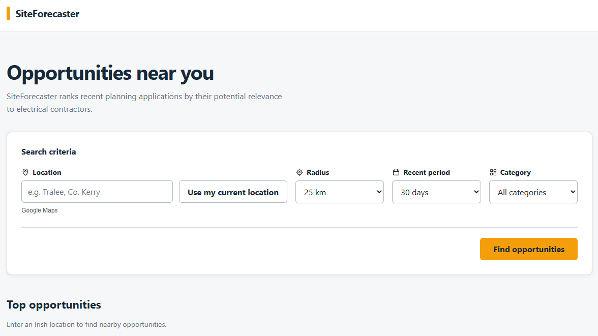
    </td>
    <td width="50%" align="center" valign="top">
      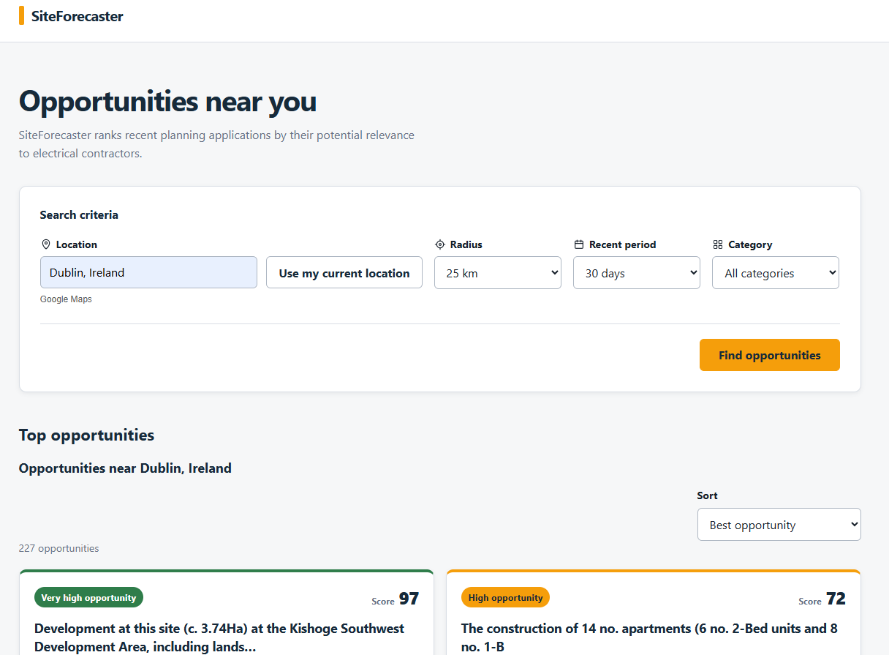
    </td>
  </tr>
  <tr>
    <td width="50%" align="center">The default search interface before a location or search criteria have been entered.</td>
    <td width="50%" align="center">A completed search showing the result count, sort control and ranked opportunity cards.</td>
  </tr>
</table>

### 10.2 Planning Opportunity Discovery

After a search is completed, SiteForecaster presents the matching planning applications as ranked opportunity cards rather than raw planning records. Each card highlights the information most useful to an electrical contractor: the opportunity level, numerical score, project description, category, distance, received date, location, planning authority, planning reference and electrical-work signal.

By default, the cards are ordered by opportunity strength so that stronger opportunities can be reviewed first. Colour-coded opportunity levels help users distinguish stronger and weaker opportunities at a glance. The electrical-work signal adds context by indicating whether electrical work is confirmed, implied, possible, or not specifically identified.

This combination of ranking and summarised project information reduces the amount of raw planning data a contractor needs to review before deciding which applications to open in more detail. The ranking is a decision-support tool, not a guarantee that a project will become paid work. It gives contractors a more focused starting point for deciding which projects are worth investigating further.

The screenshots below show the discovery results at different ranking levels. The first view contains the strongest opportunities, including confirmed electrical-work signals, while the second view shows high and medium opportunities alongside implied and possible electrical-work signals.

<div align="center">
  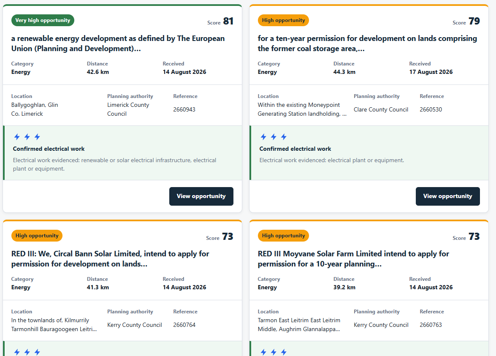
</div>

<p align="center">Highest-ranked opportunities with confirmed electrical-work signals.</p>

<div align="center">
  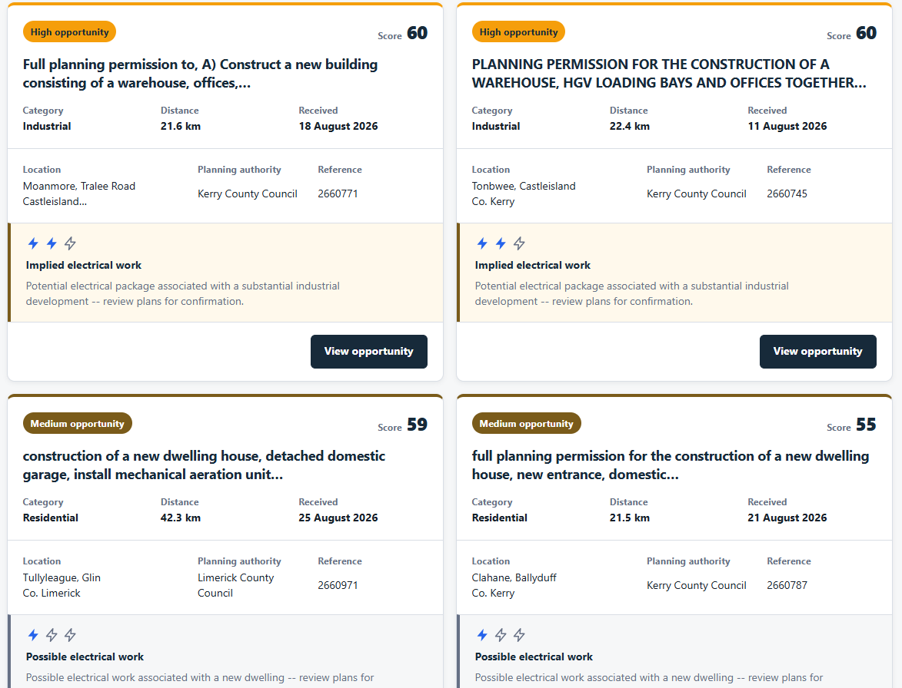
</div>

<p align="center">High and medium opportunities showing implied and possible electrical-work signals.</p>

### 10.3 Opportunity Scoring

Each SiteForecaster opportunity receives a numerical score to help contractors prioritise which planning applications to review first. The score is converted into an opportunity level: Very High, High, Medium, Low or Very Low. Scoring is deterministic and explainable rather than a black-box prediction, so users can understand the factors behind an application's final ranking.

Selecting **View opportunity** opens a dedicated detail page with the fuller project context behind the score: project metadata, the electrical-work signal, planning description and score breakdown. **Back to opportunities** returns users to their previous results, while **View official application** opens the original planning source for verification.

The detailed opportunity view shows the overall score alongside the project category, distance, received date, planning authority, application reference and electrical-work signal. Beneath this, the score breakdown explains how points were awarded across five factors: Project scope, Electrical relevance, Project scale, Lead timing and Category fit.

Each scoring factor displays both the points awarded and a short plain-English explanation. This makes the ranking easier to interpret and lets users judge whether the score reflects the project's characteristics. The electrical-work signal is displayed separately but is closely related to the electrical relevance portion of the score.

The scoring system is a prioritisation aid, not a guarantee of commercial value or paid work. A high score indicates that an application appears more relevant under the current contractor-focused rules. Users should still review the original planning application before taking further action.

The screenshots below show the opportunity detail page and the complete score breakdown.

<div align="center">
  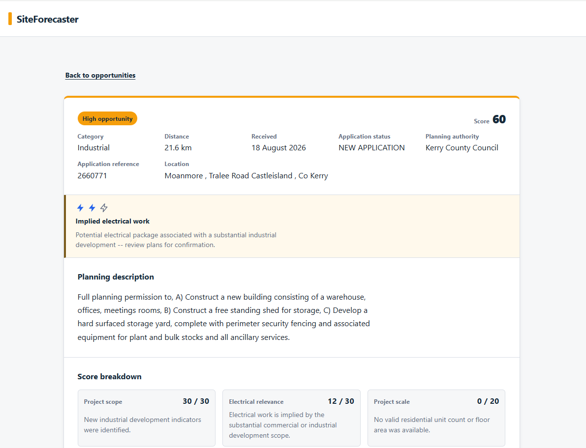
</div>

<p align="center">Opportunity detail view showing the final score, project information and electrical-work signal.</p>

<div align="center">
  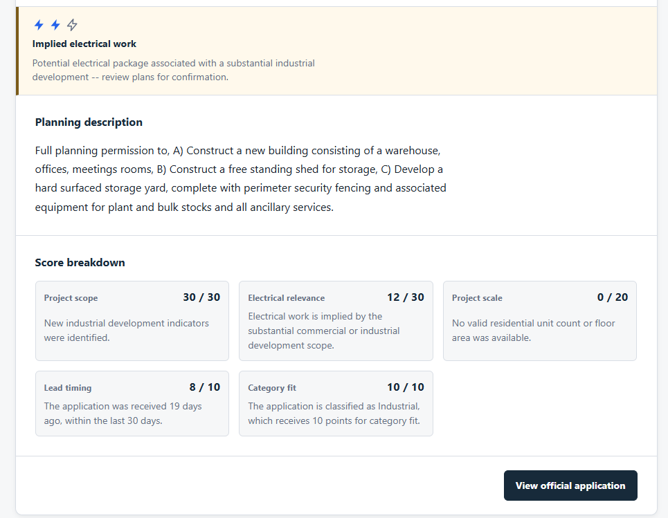
</div>

<p align="center">Score breakdown showing how points are awarded across the five scoring dimensions.</p>

### 10.4 Electrical Work Signals

Alongside the overall opportunity score, SiteForecaster assigns a separate electrical-work signal to each planning application. This gives electrical contractors a quick indication of how strongly the available planning description suggests that electrical work may be involved.

The signal uses four levels, ranging from direct evidence to no specific electrical indication. Each state combines a bolt indicator, a distinct visual treatment and a short plain-English explanation so users can understand the reasoning without opening the full planning record.

**Confirmed electrical work** means the planning description contains direct evidence of electrical work. **Implied electrical work** means the project type or scale strongly suggests an electrical package is likely. **Possible electrical work** indicates that some project characteristics may involve electrical work, but the evidence is weaker. **No specific electrical work** means the description does not provide enough evidence to identify electrical work.

These evidence and inference levels help users prioritise planning applications. They are not guarantees that electrical work will become available and should be considered alongside the full planning details and opportunity score.

<table>
  <tr>
    <th width="50%" align="center" valign="top">Confirmed electrical work</th>
    <th width="50%" align="center" valign="top">Implied electrical work</th>
  </tr>
  <tr>
    <td width="50%" align="center" valign="top">
      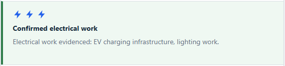
    </td>
    <td width="50%" align="center" valign="top">
      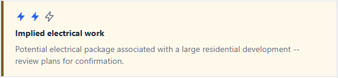
    </td>
  </tr>
  <tr>
    <th width="50%" align="center" valign="top">Possible electrical work</th>
    <th width="50%" align="center" valign="top">No specific electrical work</th>
  </tr>
  <tr>
    <td width="50%" align="center" valign="top">
      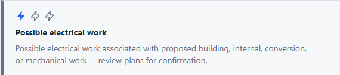
    </td>
    <td width="50%" align="center" valign="top">
      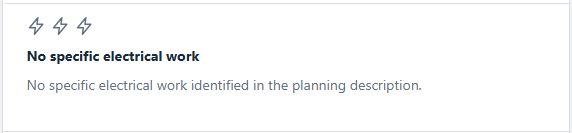
    </td>
  </tr>
</table>

### 10.5 Sorting & Pagination

SiteForecaster includes sorting and pagination controls to make larger result sets easier to review. After a search is completed, users can see how many opportunities were returned and choose how those results should be ordered.

The sort control supports **Best opportunity**, **Nearest** and **Newest**. Best opportunity uses the SiteForecaster opportunity score to prioritise stronger matches, Nearest orders applications by distance from the selected location, and Newest prioritises applications by received date.

Pagination keeps larger result sets manageable by splitting them into smaller pages rather than one excessively long page. Users can move backwards and forwards using the **Previous** and **Next** controls while keeping their existing search criteria and sort selection. The current page and total page count are displayed between the controls. The compact layout is designed to remain usable across desktop, tablet and mobile screen sizes.

The screenshots below show the sorting options and the compact pagination controls used in the results interface.

<div align="center">
  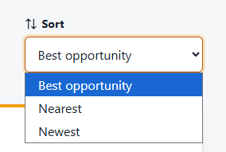
</div>

<p align="center">Sort options for prioritising results by opportunity strength, distance or recency.</p>

<div align="center">
  
</div>

<p align="center">Compact pagination controls showing the current page and navigation between result pages.</p>

### 10.6 Application States & Error Handling

SiteForecaster distinguishes between a successful search that returns no matching opportunities and a technical failure while loading results.

When a search completes successfully but no opportunities match the selected criteria, the interface shows a neutral empty-state message and suggests broadening the search radius, recent period or category.

If opportunities cannot be loaded because of a connection, API or backend problem, the interface shows a separate error state with a **Try again** action to retry the same request. This makes it clear that something went wrong technically rather than simply finding no matching planning applications. Retrying may help, but does not guarantee that the request will succeed.

The screenshots below show these two states side by side.

<table>
  <tr>
    <th width="50%" align="center" valign="top">No opportunities found</th>
    <th width="50%" align="center" valign="top">Load error</th>
  </tr>
  <tr>
    <td width="50%" align="center" valign="top">
      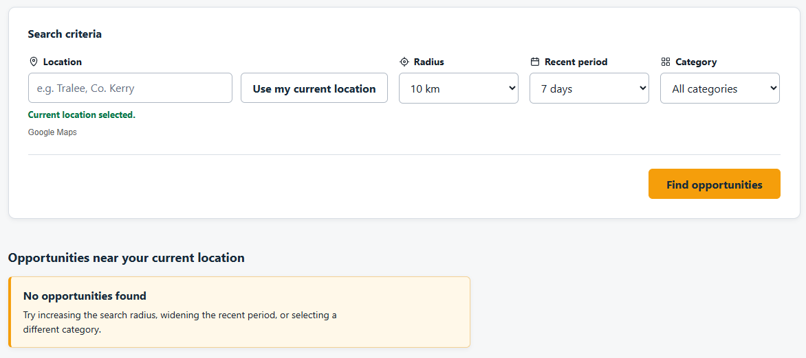
    </td>
    <td width="50%" align="center" valign="top">
      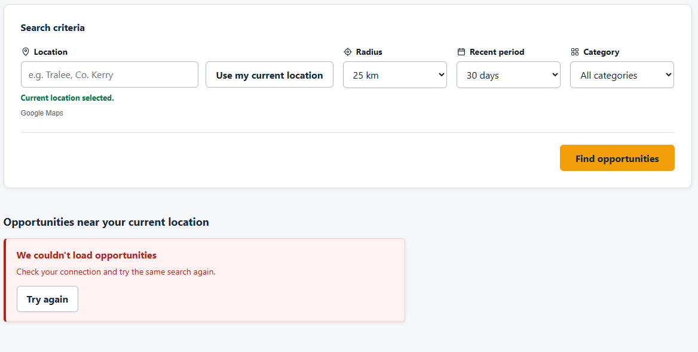
    </td>
  </tr>
  <tr>
    <td width="50%" align="center" valign="top">A successful search with no matching opportunities.</td>
    <td width="50%" align="center" valign="top">A technical load failure with a retry option.</td>
  </tr>
</table>

## 11. Opportunity Scoring Logic

SiteForecaster uses deterministic rules to score planning opportunities. The implementation in `backend/app/services/opportunity_scorer.py` combines five components:

| Component | Maximum points |
| --- | ---: |
| Project scope | 30 |
| Electrical relevance | 30 |
| Project scale | 20 |
| Lead timing | 10 |
| Category fit | 10 |
| Total | 100 |

**Project scope** represents the type of work proposed. The rules distinguish major development (30 points), meaningful extensions, refurbishment, conversion or fit-out (20), smaller alterations or upgrades (10), and recognised minor, retention or site-only work (5). Unrecognised scope receives 0. Scope is assessed from the main proposal and application type; text after recognised ancillary-work markers is excluded from this component, while the full text remains available for size and electrical evidence.

**Electrical relevance** represents the strength of electrical evidence. Recognised direct evidence is checked first: EV charging, battery storage, substations or explicit electrical works receive 30 points; renewable installations receive 25; significant lighting receives 20; and qualifying electrical plant or equipment receives 15. These indicators are not added together: the strongest qualifying direct indicator determines the component score. Phrase checks exclude references preceded by specified negation, existing-work or removal terms, and general plant terms require substantial non-residential scope.

Without direct evidence, contextual rules can award 10, 12 or 15 points for inferred electrical work, depending on the proposal, category and scale. Qualifying possible work receives 6 points, or 5 for replacement of one external light fitting; unavailable evidence receives 0. These are specific proposal checks, not an assumption that every building needs electrical work: residential, institutional, building-work and powered-infrastructure rules include scope and context checks.

**Project scale** uses valid residential unit counts or floor area, preferring structured values and falling back to recognised values in the text. Unit counts of 1, 2–9, 10–19, 20–49 and 50 or more receive 4, 8, 12, 16 and 20 points respectively. Positive floor areas below 100, from 100 to below 500, from 500 to below 2,000, from 2,000 to below 5,000, and 5,000 square metres or more receive the same point bands. If both measures are available, only the higher score is used; without either, this component receives 0.

**Lead timing** measures recency against the assessment date, which defaults to the current UTC date. Applications received 0–14 days ago receive 10 points; 15–30 days receive 8; 31–60 days receive 5; and 61–90 days receive 2. Older, missing or future received dates receive 0.

**Category fit** assigns a fixed weighting to the classified project category using the values below.

### Raw and displayed scores

The five component scores are added together to produce `raw_opportunity_score`. The application retains this arithmetic total separately from `opportunity_score`, the effective score shown to the user after the electrical-evidence ceiling is applied:

`opportunity_score = min(raw_opportunity_score, electrical_evidence_ceiling)`

| Electrical evidence | Maximum displayed score |
| --- | ---: |
| No specific evidence / unavailable | 39 |
| Possible | 59 |
| Implied / inferred | 79 |
| Confirmed / direct | 100 |

This prevents a project with weak or no electrical evidence from receiving a very high displayed score just because its other characteristics score well. The ceiling does not change the individual component points or the retained raw total.

### Opportunity levels

The opportunity level is based on the effective `opportunity_score`, not the uncapped raw score.

| Opportunity level | Displayed score |
| --- | ---: |
| Very High | 80–100 |
| High | 60–79 |
| Medium | 40–59 |
| Low | 20–39 |
| Very Low | 0–19 |

### Category fit

| Category | Points |
| --- | ---: |
| Industrial | 10 |
| Commercial | 10 |
| Energy | 10 |
| Mixed use | 9 |
| Residential | 7 |
| Infrastructure | 7 |
| Other | 3 |

### Worked example

An application described as “Construction of a new industrial facility”, classified as industrial, received 20 days before assessment and with no unit count or floor area, scores 30/30 for project scope, 12/30 for electrical relevance, 0/20 for project scale, 8/10 for lead timing and 10/10 for category fit. The raw total is **60**; its inferred electrical evidence has a ceiling of **79**, so the displayed score remains **60**, giving it a **High** opportunity level.

### Why rule-based scoring

The current MVP uses rules rather than machine learning so that the same inputs, including the assessment date, produce the same result. Each component can be explained and the rules can be tested directly. This supports reviewing and adjusting the current scoring criteria; it does not make the score a guarantee of commercial value or paid work.

### Sorting

**Best opportunity** sorts by the effective `opportunity_score` in descending order, not the raw uncapped total. Ties are resolved by newer received date, then higher application ID; missing received dates sort after known dates within the same score.

## 12. Application Architecture

SiteForecaster has a browser frontend, a single FastAPI application and a PostgreSQL/PostGIS database. Nginx serves the frontend and forwards API requests to the backend in production.

### 12.1 Frontend

The frontend is built with React and TypeScript using Vite. It runs in the browser and handles the search form, results, sorting, pagination, detail views and user-facing loading, empty and error states. It requests data from the backend API rather than connecting directly to the database or planning-data source.

For production, Vite builds static assets that Nginx serves from `/var/www/siteforecaster` on the EC2 host.

### 12.2 Backend

The backend is a single FastAPI application running in Docker in production. Its Python code handles location lookup and geocoding, planning opportunity queries, classification, opportunity scoring and electrical-work assessment. Planning data ingestion and sync are implemented as separate commands in the same backend codebase.

SQLAlchemy provides database access, while Alembic manages schema migrations.

### 12.3 API Layer

The API is the boundary between the browser interface and the backend logic and data. The frontend calls FastAPI REST endpoints for location lookup, opportunity results and planning application details. These calls send search criteria and other request values as URL query parameters or path values and receive JSON responses.

In production, Nginx proxies `/api/` traffic to the FastAPI container through the host's loopback port `8000`. The separate `/health` endpoint is also proxied and is used by the API container's health check. Section 14 documents the endpoints in more detail.

### 12.4 Database

PostgreSQL stores the planning applications locally, and PostGIS provides geographic querying support. Nearby searches use spatial queries against these stored records rather than calling the external planning service for every user search. SQLAlchemy models map application data to database tables, and Alembic tracks schema changes.

Docker Compose runs the database and API as separate services on EC2, with database files kept in a named volume. The database health check uses `pg_isready`, and Compose waits for it to pass before starting the API.

In production, a user loads the React frontend through Nginx. When the frontend needs data, requests to `/api/` are proxied to the FastAPI container. For opportunity searches, FastAPI reads from PostgreSQL/PostGIS and applies the relevant search, scoring and business logic. The result is returned as JSON and rendered in the browser.

Irish planning data is retrieved from the external ArcGIS planning source by import and sync commands and stored in PostgreSQL. Scheduled sync commands are run through systemd timers on the host, separately from user requests. When a typed location needs to be resolved, the backend calls Google geocoding; the browser does not connect directly to either external source.

| Layer | Main technology | Responsibility |
| --- | --- | --- |
| Browser UI | React, TypeScript, Vite | Search, results and interaction |
| Web server | Nginx | Static frontend serving and reverse proxy |
| API | FastAPI | Business logic and REST endpoints |
| Data access | SQLAlchemy / Alembic | ORM and schema migrations |
| Database | PostgreSQL + PostGIS | Planning data and spatial queries |
| External data | Irish Planning ArcGIS + Google geocoding | Planning feed and location lookup |

## 13. Data Flow

### User search flow

1. The user selects a location and search criteria in the React frontend.
2. Once coordinates are available, the browser sends them and the criteria through Nginx to FastAPI in production.
3. FastAPI queries PostgreSQL/PostGIS using the coordinates, radius and other filters.
4. Matching planning applications are returned to the backend.
5. The backend applies opportunity scoring and the selected sort order to prepare the requested results page.
6. FastAPI returns the results as JSON.
7. React renders the results in the browser.

### Location lookup flow

When the user searches with a place name, the frontend first sends it to the backend. FastAPI calls the configured Google geocoding service and returns the resolved coordinates, which the frontend uses for the nearby planning search. The browser does not call Google directly.

The current-location option obtains coordinates from the browser instead. Those coordinates are used for the same nearby search flow without a place-name lookup.

### Planning data sync flow

Planning data is imported from the Irish Planning ArcGIS source by backend import and sync commands, separately from user searches. The backend processes the records and upserts them into PostgreSQL, inserting new records and updating existing ones. Scheduled syncs run in the background through the host's systemd timers.

Later searches query the local PostgreSQL/PostGIS database; they do not call the external planning source each time a user searches.

| Flow | Source | Destination | Purpose |
| --- | --- | --- | --- |
| User search | React frontend | FastAPI API | Submit search criteria |
| Spatial query | FastAPI | PostgreSQL/PostGIS | Find nearby planning applications |
| Geocoding | FastAPI | Google geocoding | Convert place names to coordinates |
| Planning sync | Irish Planning ArcGIS | PostgreSQL | Keep local planning data up to date |
| Results | FastAPI | React frontend | Return ranked opportunities as JSON |

Keeping these flows separate means normal user searches rely on the local database, while external planning data is refreshed independently. This reduces the application's dependence on the upstream planning service during each search.

## 14. API Endpoints

SiteForecaster exposes a REST API through FastAPI. The frontend uses it for backend geocoding, planning application details and ranked opportunity searches. Responses are JSON. All endpoints below use GET; inputs are query parameters unless shown as a path parameter, and no request body is required.

| Method | Endpoint | Purpose |
| --- | --- | --- |
| GET | `/api/v1/locations/geocode` | Resolve a place name to coordinates |
| GET | `/api/v1/opportunities` | Return a sorted page of nearby opportunities |
| GET | `/api/v1/planning-applications/nearby` | Find planning applications by distance |
| GET | `/api/v1/planning-applications` | List and filter planning applications |
| GET | `/api/v1/planning-applications/categories/summary` | Count applications by category |
| GET | `/api/v1/planning-applications/{application_id}` | Retrieve one application's details |
| GET | `/health` | Check API liveness |
| GET | `/` | Return the API identification message |

### Geocode location

`GET /api/v1/locations/geocode` requires `query`, a string of 1–200 characters that must not be blank after trimming. It returns `query`, `display_name`, `latitude` and `longitude`. FastAPI calls Google geocoding on the frontend's behalf; the returned coordinates are then used for the opportunity search.

A location with no match returns 404. Invalid input returns 422; service configuration, upstream failure and timeout errors return 503, 502 and 504 respectively. Rate limiting can return 429.

### Opportunities

`GET /api/v1/opportunities` requires `latitude` (−90 to 90) and `longitude` (−180 to 180). Optional query parameters are:

- `radius_km`: greater than 0 and at most 50; default `25`.
- `recent_days`: integer from 1 to 365; default `30`. Filters received dates from the current UTC date minus this number of days, inclusively.
- `category`: `residential`, `commercial`, `industrial`, `energy`, `infrastructure`, `mixed_use` or `other`; omitted means no category filter.
- `sort`: `best` (default), `nearest` or `newest`, ordering by effective opportunity score, distance or received date respectively.
- `page`: integer of at least 1; default `1`.
- `page_size`: integer from 1 to 100; default `20`.

The response contains `items`, `page`, `page_size`, `total` and `total_pages`. Each item includes planning identifiers and project information, `distance_km`, `category`, `opportunity_score`, `raw_opportunity_score`, `opportunity_level`, `opportunity_breakdown`, `opportunity_score_components` and `electrical_work_brief`. The backend generates the scoring and electrical-work information described in Section 11.

The feed excludes applications with the statuses `Invalid - Case Closed`, `Application Invalid`, `INCOMPLETED APPLICATION` and `WITHDRAWN`.

### Nearby planning applications

`GET /api/v1/planning-applications/nearby` requires `latitude` (−90 to 90), `longitude` (−180 to 180) and `radius_km` (greater than 0, at most 50; no default). Pagination uses `limit` (1–100, default `20`) and `offset` (at least 0, default `0`).

Optional filters are `received_from`, `received_to` (dates in `YYYY-MM-DD` format), `application_status`, `decision`, `category` and `recent_days` (1–365). They default to no filter. Category values are the same as for opportunities. Date bounds are inclusive; `recent_days` cannot be combined with `received_from` and returns 422 if both are supplied.

The response contains `items`, `limit`, `offset` and `total`. Items expose the fuller planning record plus `distance_km`, classification, scores and electrical-work information. Unlike the opportunities feed, this endpoint always orders by ascending distance, then ascending ID, uses limit/offset pagination and does not apply the opportunity feed's status exclusions. It has no `sort` parameter; both endpoints include scoring.

### Other planning endpoints

`GET /api/v1/planning-applications` uses the same optional filters and limit/offset defaults as the nearby endpoint, with an additional `planning_authority` filter and no coordinate or radius inputs. It returns `items`, `limit`, `offset` and `total`, ordered by descending received date and ID. Items include scores and electrical-work information but no search-relative distance.

`GET /api/v1/planning-applications/categories/summary` accepts optional `planning_authority`, `application_status`, `decision`, `received_from`, `received_to` and `recent_days` filters. The same date rules apply. It returns `total` and a `categories` object mapping the seven category names to counts; there is no pagination.

`GET /api/v1/planning-applications/{application_id}` takes a positive integer path parameter. It returns one planning record with classification, scoring components and electrical-work information, or 404 if the record does not exist. The frontend uses this endpoint for its detail view. Database-backed routes are rate-limited and may return 429; invalid parameters return 422.

### Health check

`GET /health` takes no parameters and returns:

```json
{"status": "ok"}
```

This is a lightweight liveness check confirming that FastAPI is responding. It does not check database readiness or other dependencies.

The FastAPI root endpoint, `GET /`, returns `{"message": "GroundSignal API"}`. In production, Nginx serves the React frontend at `/` instead. FastAPI's default Swagger UI, ReDoc and OpenAPI schema routes are enabled at `/docs`, `/redoc` and `/openapi.json` on the API service; the production Nginx configuration does not proxy those paths.

### Example opportunity request

```http
GET /api/v1/opportunities?latitude=53.3498&longitude=-6.2603&radius_km=25&recent_days=30&category=industrial&sort=best&page=1&page_size=20
```

Illustrative response excerpt, with other item fields omitted. The score shown assumes the industrial proposal was received 20 days before assessment:

```json
{
  "items": [
    {
      "id": 20,
      "application_number": "26/1042",
      "description": "Construction of a new industrial facility.",
      "distance_km": 4.25,
      "opportunity_score": 60,
      "raw_opportunity_score": 60,
      "opportunity_level": "high",
      "electrical_work_brief": {
        "evidence_level": "inferred",
        "summary": "Potential electrical package associated with a substantial industrial development -- review plans for confirmation.",
        "signals": []
      }
    }
  ],
  "page": 1,
  "page_size": 20,
  "total": 1,
  "total_pages": 1
}
```

## 15. Database & Data Models

### Database choice

PostgreSQL is the main application database, with PostGIS providing geographic support for searches within a chosen radius of coordinates. In production, it runs as a separate Docker Compose service, with its data persisted in a named volume.

### Planning application model

The `PlanningApplication` SQLAlchemy model maps to the `planning_applications` table. It keeps the source record's identifiers, project details and location together with its planning status and update metadata. Fields such as description, dates, category and project scale can be absent when the source does not provide them.

| Data area | Examples |
| --- | --- |
| Identification | Internal `id`, `application_number`, `source_object_id`, `planning_authority` |
| Project | `description`, `category`, `application_type`, `application_url` |
| Location | `address`, `postcode`, geographic point in `location` |
| Planning status | `application_status`, `decision`, `received_date`, `decision_date`, `grant_date` |
| Project scale | `number_residential_units`, `floor_area` where available |
| Source tracking | `source_object_id`, `source_updated_at`, local `created_at` and `updated_at` timestamps |

The source identifier is unique. Planning authority and application number are indexed together but are not a unique pair, so distinct upstream records can share that reference. The stored category is constrained to the supported classification values or null.

### Spatial data

The `location` column uses GeoAlchemy2's `Geography(geometry_type="POINT", srid=4326)`, with a PostGIS GiST spatial index. Coordinates are stored as a geographic point rather than separate latitude and longitude columns.

Nearby queries construct a search point from longitude and latitude, use `ST_DWithin` to filter within the requested radius, and use `ST_Distance` to calculate distance. The API converts the radius from kilometres to metres for these geography operations and returns distances in kilometres.

### SQLAlchemy

SQLAlchemy provides the data-access layer between FastAPI and PostgreSQL. Python models represent tables, and backend queries use SQLAlchemy expressions and sessions for filtering, ordering, reading and updating records. PostGIS functions are called through those expressions rather than manually assembling SQL strings for normal searches.

### Alembic migrations

Version-controlled Alembic migrations in `backend/alembic/versions/` track schema changes so they can be applied consistently in development and production. The initial migration created the planning table and spatial index; a later migration added the category column, its allowed-value constraint and index. Another replaced the authority/reference uniqueness constraint with a non-unique index to allow distinct source records with the same planning reference.

### Data persistence and updates

Import and sync commands store records from the Irish Planning ArcGIS source locally. Ingestion uses the upstream `OBJECTID`, stored as `source_object_id`, to recognise existing records: new identifiers are inserted and existing records are updated. Repeated identifiers within an import page reuse the same record, and the database's unique source index prevents duplicate source identifiers.

Scheduled sync commands refresh this stored data separately from user searches. The transformer also assigns the stored planning category during ingestion.

### Scoring data

Opportunity scores are calculated when API results are requested; they are not stored in the planning table. The backend generates the raw and effective scores, opportunity level, component breakdown and electrical-work assessment from the application data and assessment date. This is separate from the category, which has a stored database column.

## 16. Geocoding & Location Handling

### Manual location search

When a user submits a place name, React sends it as `query` to `GET /api/v1/locations/geocode`. FastAPI calls Google geocoding with an Ireland country filter and returns the first result's `display_name`, `latitude` and `longitude`. The frontend uses these coordinates for the nearby opportunity search and the display name for the contextual results heading.

### Current location

Selecting **Use my current location** calls the browser's geolocation API. If coordinates are available, the frontend selects them and clears the typed location. Selecting **Find opportunities** then uses those coordinates directly, without place-name geocoding. Typing a location again clears the current-location selection.

### Why geocoding happens through the backend

The browser calls SiteForecaster's endpoint rather than Google directly. The provider integration and its credential stay in the backend configuration, so the backend geocoding key is not included in frontend source code or returned in the location response.

### Coordinate and radius validation

The search API accepts latitude from −90 to 90 and longitude from −180 to 180. `radius_km` must be greater than 0 and no more than 50; the opportunities endpoint defaults to 25 km. The geocoding service also checks that provider coordinates are finite numbers within these geographic bounds before returning them.

### Location search flow

1. The user enters a location and submits the search.
2. React sends the place name to FastAPI.
3. FastAPI resolves it through Google geocoding.
4. Coordinates and a display name are returned to React.
5. React requests opportunities using those coordinates, the selected radius and other filters.
6. PostgreSQL/PostGIS supplies nearby planning applications for the backend to process and return.

For current location, browser geolocation replaces steps 2–4.

### Errors and edge cases

The location field is required unless current location is selected. The backend requires `query` to contain 1–200 characters and rejects blank or whitespace-only input. A geocoding response with no match produces the frontend's **Location not found** state, which asks users to check the spelling or try another Irish location.

Provider failures, invalid provider responses, missing configuration and timeouts are handled as geocoding errors. The Google request uses a five-second timeout setting; the frontend shows **Location search unavailable** when lookup fails for these reasons. If browser permission is denied, geolocation is unavailable or another browser location error occurs, **Current location unavailable** lets the user know to enter a location instead or try again.

### Privacy

Typed place names are sent to the backend and Google for geocoding. Current-location coordinates are sent to the backend for the planning search, so precise location can be processed. The current search state is held in React memory; these search and geocoding paths do not persist a user location history in the database. Privacy-safe logging is covered separately in Section 17.

## 17. Security & Privacy

### 17.1 API & Secret Management

Database credentials and the Google geocoding key are supplied through environment configuration rather than hard-coded production values in application source. Docker Compose passes the configured credentials to the relevant services. Google geocoding runs through the backend, so its key is not included in frontend source or location responses.

`.gitignore` excludes `.env` files and their variants, apart from `.env.example`, along with common private-key and certificate file types. These exclusions help prevent accidental additions; secrets must never be committed and should be rotated if exposed.

CI runs `pip-audit` against the backend requirements and `npm audit --omit=dev --audit-level=high` for frontend production dependencies. These checks flag known dependency vulnerabilities; they are not a full security assessment.

### 17.2 Rate Limiting

The geocoding endpoint allows 20 requests per client IP in a rolling 60-second window. The opportunities and planning-applications routes share a separate limit of 60 requests per client IP over 60 seconds. These limits reduce repeated calls to the paid geocoding provider and database-intensive endpoints. Excess requests receive HTTP 429 with a `Retry-After` header.

The limiters keep their state in memory within one API process; they are not shared across multiple processes or retained after restart. They do not cover `/health` or the API root route. Forwarded client addresses are accepted only from the configured trusted proxy networks, and Nginx replaces incoming forwarding headers with the address it observes.

### 17.3 Privacy-Safe Logging

The production Docker command starts Uvicorn with `--no-access-log`, avoiding a second access log containing request query strings. Nginx uses the `siteforecaster_safe` format, which records the request method and `$uri` path rather than the full request URL. Query strings and Referer headers are omitted from this access log, which matters because search parameters can contain place names and coordinates.

This reduces logged request details; it does not mean no logs are collected. Nginx access logs still include the client address, timestamp, protocol, status, response size and user agent. Error logging remains available, and the access-log format does not control what error logs may contain.

### 17.4 Security Headers

The repository's Nginx HTTPS server configuration sets the following headers with `always`, including on error responses. These are configuration-backed controls, not a claim that a live security audit has been performed.

| Header | Configured purpose |
| --- | --- |
| `X-Content-Type-Options: nosniff` | Prevent browsers from guessing a different content type |
| `X-Frame-Options: DENY` | Prevent the site from being embedded in a frame |
| `Referrer-Policy: strict-origin-when-cross-origin` | Limit cross-origin referrer information to the origin and omit it on HTTPS-to-HTTP requests |
| `Permissions-Policy: geolocation=(self), camera=(), microphone=()` | Allow same-origin geolocation while disabling camera and microphone access |
| `Strict-Transport-Security: max-age=86400` | Tell browsers to use HTTPS for this host for one day after receiving the header over HTTPS |
| `Content-Security-Policy` | Restrict scripts, styles, connections, fonts and form submissions to the same origin; allow same-origin and data-URL images; block objects, framing and base-URL changes |

FastAPI/Pydantic validates API inputs, and normal database queries use SQLAlchemy expressions. The API is published only on the EC2 host's loopback interface and reached through Nginx; the database runs as a separate Compose service without a published host port.

The current MVP has no user accounts or private user-data features, so its public search API does not require authentication. Authentication is planned and would be needed before adding accounts, saved shortlists or other user-specific data. The measures described here do not amount to a claim that the application is fully secure or penetration-tested.

## 18. Data Licensing & Legal Considerations

### Planning data source

SiteForecaster uses the Irish Planning ArcGIS source to surface and prioritise planning opportunities. The application's Data Sources page identifies this as the National Planning Applications dataset, published by the Department of Housing, Local Government and Heritage. SiteForecaster is not the original publisher or authority for these records. Users can follow **View official application**, where a source link is available, to verify the underlying planning information.

### Attribution

The Data Sources page links to the National Planning Applications dataset and displays the attribution “Contains Irish Public Sector Data licensed under a Creative Commons Attribution 4.0 International (CC BY 4.0) licence.” It also distinguishes SiteForecaster's categorisation, scoring and electrical-work assessments from the original government data. This records the attribution currently provided by the project, rather than making a separate claim about reuse rights.

The search form displays **Google Maps** attribution. The Privacy and Terms pages link to Google's Privacy Policy and the Google Maps/Google Earth Additional Terms of Service. Third-party data and services remain subject to their own applicable terms; these notices do not establish that every licensing or service requirement has been independently reviewed.

### Data accuracy and freshness

Scheduled syncs refresh SiteForecaster's local planning data, but upstream records can still be delayed, incomplete or corrected later. SiteForecaster should not be treated as the official planning record. Check the original planning source or application before acting on a lead.

### Opportunity scoring disclaimer

SiteForecaster adds its own scores and electrical-work interpretations to the source data. These are decision-support signals: a high score does not mean that a contract, tender or paid job exists. Users should review the original planning application before contacting anyone or making a business decision.

### Personal data and privacy

The current MVP does not provide user accounts. Typed locations are sent to the backend and Google for geocoding, while browser coordinates are used for nearby searches after the user chooses the current-location option and grants permission. The Privacy page states that the MVP does not intentionally create a user location history or profile from these searches.

Location and technical request data can still be processed. IP addresses are used temporarily for rate limiting and appear in the configured Nginx access logs. Section 17 describes the privacy-safe logging controls; this is not a claim that no personal data is processed or that formal GDPR compliance has been established.

### External links

Official planning pages and other linked services have their own terms, privacy policies and availability. Their content and operation are outside SiteForecaster's control.

### Legal positioning

SiteForecaster is an independent planning-opportunity tool and is not affiliated with, endorsed by, or a replacement for the official planning authorities or source systems it references.

This section describes the project's current data-use approach and is not legal advice.

## 19. Technologies Used

SiteForecaster uses a straightforward stack suited to the current MVP, keeping the browser interface, API and database separate without adding infrastructure the application does not need.

### Backend

| Technology | Purpose |
| --- | --- |
| Python | Implements API logic, scoring and data-processing commands. |
| FastAPI | Defines the API routes and request handling. |
| Pydantic | Validates API data and defines response schemas. |
| Uvicorn | Runs the FastAPI application. |
| SQLAlchemy | Builds database queries and maps Python models to tables. |
| GeoAlchemy2 | Provides PostGIS types and spatial integration with SQLAlchemy. |
| Alembic | Tracks and applies database schema migrations. |
| Psycopg | Connects the backend to PostgreSQL. |
| HTTPX | Sends requests to the planning source and geocoding service. |
| python-dotenv | Loads local environment configuration. |

### Frontend

| Technology | Purpose |
| --- | --- |
| React | Renders the interactive browser interface. |
| TypeScript | Adds type checking to frontend code. |
| Vite | Runs the development server and builds production static assets. |
| HTML | Provides page structure and semantic interface elements. |
| CSS | Defines layout, responsive styling and visual states. |
| Node.js / npm | Run frontend build, test and package tooling, not the backend. |

### Database

| Technology | Purpose |
| --- | --- |
| PostgreSQL | Stores planning application records. |
| PostGIS | Supports geographic points and nearby-distance queries. |

### Testing

| Technology | Purpose |
| --- | --- |
| pytest | Runs backend API, scoring and data-processing tests. |
| FastAPI TestClient | Exercises API routes in backend tests. |
| Vitest | Runs frontend tests. |
| React Testing Library | Tests rendered components through their visible interface. |
| Testing Library user-event | Simulates typing, clicks and keyboard interaction. |
| Testing Library jest-dom | Adds DOM assertions to the Vitest tests. |
| jsdom | Supplies the browser-like DOM environment for frontend tests. |
| ESLint / typescript-eslint | Check frontend code with TypeScript, React Hooks and React Refresh rules. |
| pip-audit / npm audit | Check dependencies for known vulnerabilities in CI. |

### DevOps & Deployment

| Technology | Purpose |
| --- | --- |
| Docker | Packages the API and runs the database container. |
| Docker Compose | Configures the API and database services together. |
| Git | Tracks source and configuration changes. |
| GitHub | Hosts the repository and project board. |
| GitHub Actions | Runs CI tests, audits, lint and builds, then uploads the frontend build artifact. |
| AWS EC2 | Hosts the production application. |
| Ubuntu Linux | Provides the production host operating system. |
| Nginx | Serves static frontend assets and proxies API requests. |
| systemd | Schedules and runs planning sync and reconciliation commands. |

Production deployment remains manual; the current GitHub Actions workflow does not deploy to EC2.

### External Services

| Technology | Purpose |
| --- | --- |
| Irish Planning ArcGIS source | Supplies planning application data for imports and syncs. |
| Google Maps Platform Geocoding | Resolves typed place names through the backend. |

### 20.1 Backend Testing

The backend uses pytest, with tests in `backend/tests/` covering the main API, scoring and planning-data behaviour. API tests use FastAPI's `TestClient`, while controlled database sessions and mocked external responses make expected results and failure cases repeatable.

| Area | What is tested |
| --- | --- |
| API | Routes, required parameters, response fields and validation |
| Scoring | Component points, level thresholds, breakdowns, raw scores and evidence ceilings |
| Classification | Planning descriptions mapped to expected categories, including ambiguous and ancillary wording |
| Search behaviour | Filters, sort order, pagination, distance responses and PostGIS query construction |
| Electrical signals | Direct, inferred, possible and unavailable evidence, including contextual and negated references |
| Error handling | Invalid input, missing records, geocoding failures, upstream timeouts and rate limits |
| Database behaviour | Connection configuration, model constraints, migration operations, ingestion updates and rollback handling |

Regression cases preserve previously corrected scoring and classification behaviour, such as distinguishing a project's main purpose from ancillary works and sorting by the evidence-capped score. The repository also includes a curated classifier benchmark that compares descriptions with expected categories. It is a regression check, not a measure of production accuracy or a trained model's performance.

These tests allow scoring-rule changes to be checked without relying only on manual testing and keep API behaviour verifiable across changes. They help catch edge cases and regressions before deployment; database query and session tests do not replace checks against a running PostgreSQL/PostGIS instance.

### 20.2 Frontend Testing

Frontend tests use Vitest with React Testing Library, user-event and jest-dom assertions in a jsdom environment. They check important component behaviour and user interactions to catch regressions when the frontend changes. API responses and browser geolocation are mocked so success and failure cases can be checked consistently.

| Area | What is tested | Result |
| ---- | -------------- | ------ |
| Search | Manual geocoding and current-location searches send the selected filters. | Pass |
| Results rendering | Contextual headings, result counts, card metadata and electrical signals render from responses. | Pass |
| Sorting | Best opportunity, Nearest and Newest request the selected order without repeating location lookup. | Pass |
| Pagination | Previous/Next requests, disabled boundaries and page resets after sort or search changes. | Pass |
| Loading state | Loading is announced, repeat submissions are blocked and existing cards remain during refreshes. | Pass |
| Empty results | No opportunities found retains the resolved location and omits the redundant static heading. | Pass |
| Error state | Location, geocoding, opportunity and detail failures show the appropriate message without raw error details. | Pass |
| Retry behaviour | Failed opportunity requests reuse search parameters, and failed detail requests can be retried. | Pass |
| Opportunity detail navigation | Detail and browser back navigation restore search results, filters, scroll and focus. | Pass |
| Home/reset navigation | Brand navigation resets the search; all three legal-page back links return home. | Pass |
| Form/input behaviour | Required location validation, default filters and switching between typed and browser location. | Pass |
| Accessibility-related behaviour | Keyboard order and activation, semantic landmarks, accessible names and navigation focus. | Pass |

Regression coverage distinguishes returning to previous results from deliberately starting a fresh search through the brand link. It also checks that failed page refreshes retain existing results and that empty searches remain distinct from technical failures.

Verified with `npm run test:run` from `frontend/`: **84 tests passed across 5 test files**. These component and interaction tests do not constitute a full browser or accessibility audit.

## Production Nginx and privacy-safe logging

Nginx is the production reverse proxy and static frontend server on EC2. Its
version-controlled configuration is in `deploy/nginx/`. The custom
`siteforecaster_safe` access-log format records the request method and `$uri`
path, but intentionally excludes query strings and referrers. This minimises
retention of user-entered location searches and coordinates. Uvicorn access
logging is disabled separately; Nginx error logging remains available.

### Install or update the Nginx configuration

From `/home/ubuntu/groundsignal` after deploying this repository revision:

```bash
sudo install -D -m 0644 deploy/nginx/siteforecaster-safe-logging.conf \
  /etc/nginx/conf.d/siteforecaster-safe-logging.conf
sudo install -D -m 0644 deploy/nginx/siteforecaster.conf \
  /etc/nginx/sites-available/siteforecaster
sudo ln -sfn /etc/nginx/sites-available/siteforecaster \
  /etc/nginx/sites-enabled/siteforecaster

sudo nginx -t
# Reload only after nginx -t succeeds.
sudo systemctl reload nginx
```

The live SSL certificate and private-key files referenced by this configuration
are managed separately. Never commit certificate or key material to this
repository.

## 26. Monitoring & Production Operations

`GET /health` returns `{"status": "ok"}` when the FastAPI process can serve
HTTP requests. It is a liveness check only: it does not query the database or
expose configuration, credentials, or infrastructure details. Docker Compose
uses this endpoint for the API container healthcheck, and Nginx proxies the
same exact path for external uptime checks.

On the EC2 host, check the application manually with:

```bash
curl -fsS https://siteforecaster.com/health
docker compose ps
docker compose logs --tail=100 api
sudo tail -n 100 /var/log/nginx/error.log
```

Docker health status, Nginx error logs, Docker API logs, and the existing
systemd planning-sync timer logs provide the MVP operational view. Privacy-safe
Nginx access logging and disabled Uvicorn access logging remain unchanged.

No external uptime alert is configured by this repository. As an optional
AWS-native manual step, create a CloudWatch alarm for the EC2 instance's
`StatusCheckFailed` metric: trigger when it is at least `1` for one five-minute
period, and send the notification to an SNS email topic with a confirmed
subscription. This monitors EC2 availability, not the application endpoint;
an external HTTP monitor can use `/health` if one is chosen later. Confirm AWS
account pricing and limits before enabling any alarm.

## Production planning-data sync

Planning applications are stored locally in PostgreSQL. The initial full import
is a separate operation; ongoing production freshness uses inclusive rolling
`ReceivedDate` windows. Existing applications are updated and missing ones are
inserted by source object ID, so repeating a window is safe and idempotent.

- The recent, near-real-time sync runs every 15 minutes with a 7-day window.
- A 90-day reconciliation runs daily at 03:15 UTC.
- `ETL_DATE` is deliberately not used as an incremental watermark because the
  source batch-refreshes older records.

Both jobs run inside the existing Docker Compose `api` container and are
scheduled by systemd timers on the Ubuntu EC2 host. The 7-day timer has been
verified in production with a successful `status=0` run.

### Install the systemd timers

From `/home/ubuntu/groundsignal` after deploying this repository revision:

```bash
sudo cp deploy/systemd/siteforecaster-planning-sync.service /etc/systemd/system/
sudo cp deploy/systemd/siteforecaster-planning-sync.timer /etc/systemd/system/
sudo cp deploy/systemd/siteforecaster-planning-reconcile.service /etc/systemd/system/
sudo cp deploy/systemd/siteforecaster-planning-reconcile.timer /etc/systemd/system/

sudo systemctl daemon-reload
sudo systemctl enable --now siteforecaster-planning-sync.timer
sudo systemctl enable --now siteforecaster-planning-reconcile.timer
```

### Verify and operate

```bash
systemctl list-timers --all | grep siteforecaster
systemctl status siteforecaster-planning-sync.timer --no-pager
systemctl status siteforecaster-planning-reconcile.timer --no-pager
journalctl -u siteforecaster-planning-sync.service -n 50 --no-pager
journalctl -u siteforecaster-planning-reconcile.service -n 50 --no-pager
```

For a manual recent sync, the default window is 7 days:

```bash
docker compose exec -T api python -m backend.app.commands.planning_sync
docker compose exec -T api python -m backend.app.commands.planning_sync --days 90
```

### Classifier evaluation

The planning classifier assigns each application an opportunity type used by
the application. It is deterministic and rule-based, not a machine-learning
model.

Run the curated labelled regression benchmark with:

```bash
docker compose exec -T api python -m backend.app.commands.evaluate_planning_classifier --benchmark
```

The current benchmark contains 34 representative labelled cases across the
seven categories. It produced 34 correct classifications, 0 incorrect
classifications, and 100.0% accuracy. This is a regression benchmark, not an
independent random sample of production data. Planning descriptions can be
incomplete or ambiguous, so users should review the original application before
acting on an opportunity.

The default command samples database records for category distribution and
manual review, but cannot report accuracy because those source records do not
have human-assigned expected categories:

```bash
docker compose exec -T api python -m backend.app.commands.evaluate_planning_classifier --sample-size 500
```
